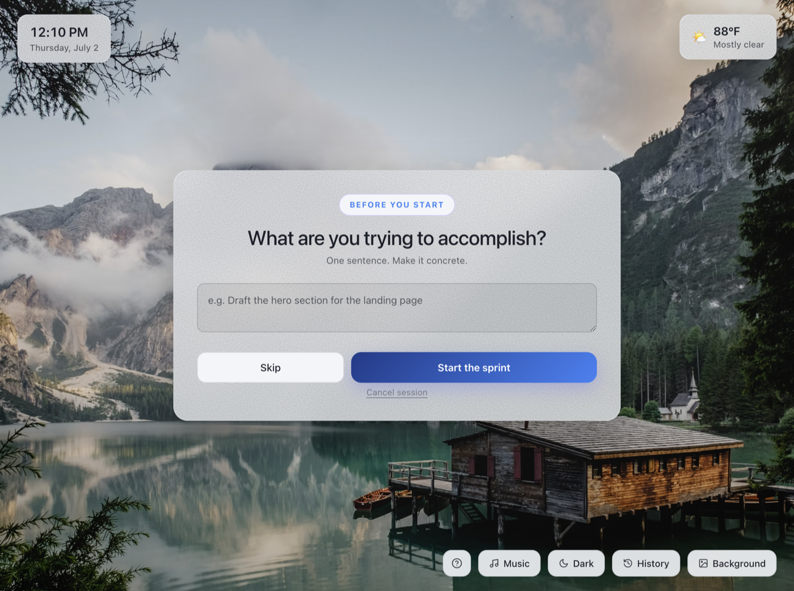

# Focus Cycles

**Setting a timer is the easy part. Or so I thought.**

Every focus app can count down from 30 minutes. None of them fix what actually kills a work block: sitting down without a plan, drifting to Slack mid-cycle, ending the day unsure what you finished. Focus Cycles is a Mac timer built around the fix, a method called **Work Cycles** that puts 30 seconds of intention in front of every block of deep work.

**[Download for Mac](../../releases/latest)** · free, open source, everything stays on your machine



## Why this exists

For years, the Work Cycles tool from Ultraworking was the closest thing I had to a productivity cheat code. Open it, answer a few honest questions, work like it mattered, review, repeat. My output on cycle days embarrassed my output on every other day.

Then Ultraworking wound down, the tool went with it, and I felt the difference within a week. The method still worked. I just didn't have software that ran it anymore.

And honestly, the software was only half the magic. The other half was the room: live sessions where high performers showed up and did cycles together, and the quiet pressure of working alongside people who take their output seriously made everyone sharper. Rebuilding that is a problem for another day. The software half I could fix now.

So I built my own. Same bones as the original, with my own tweaks: a one-question sprint mode for busy days, a local history dashboard that turns your reviews into patterns over time, focus sounds, and a Mac app that opens fast and stays out of the way. It's free and open source because the method deserves to keep living. Built with love, in the most literal sense: I made this to get my own best working days back.

## The method, in one minute

Work Cycles was created by Sebastian Marshall and the team at Ultraworking, who tested it across thousands of work sessions. The insight: the quality of a focus block is mostly decided before it starts. So instead of just timing your work, the method wraps every cycle in three tiny checkpoints.

1. **Plan** (30 seconds). What am I trying to accomplish this cycle? How will I get started? What might pull me off course?
2. **Focus** (30 minutes, adjustable). One target. The timer holds you to it, and your target stays on screen under the countdown.
3. **Review** (30 seconds). Did I hit the target? What distracted me? What should the next cycle do differently?

Longer sessions add a **prep** before the first cycle and a **debrief** at the end, so lessons from today's work survive until tomorrow. The ethos, straight from Ultraworking: eliminate the meta-work, amplify the real work.

In a hurry? A 1-cycle sprint asks exactly one question and starts the clock. And every prompt is skippable, always.

## Why your answers are worth writing down

Most timers throw your session away at midnight. Focus Cycles keeps every plan, review, and debrief in a local dashboard, so patterns you'd never notice start surfacing:

- how much focused time you actually log per day, versus what it felt like
- your target hit rate, the percentage of cycles that finished what they planned
- which distractions keep reappearing in your reviews
- your streak, and your best focus window of the day

It's the difference between "I was busy" and knowing. Export everything to CSV whenever you want.

## Built for people who hate friction

- **Fast.** One HTML file inside a thin Mac wrapper. Opens instantly, idles quietly, animations pause when the window loses focus.
- **Crash-proof.** Quit, crash, or reboot mid-cycle and the app resumes at the exact second you left, prompts included.
- **Keyboard-first.** Space to start, S to skip, M for music, numbers to set cycle count. Press `?` inside the app for the full map.
- **Focus sounds, zero setup.** Lofi (Lofi Girl's 1 A.M Study Session on loop), Synthwave radio, or locally generated rain that works with no internet. One key kills the sound.
- **Yours.** No account, no server, no analytics. Your history lives in the app on your Mac and nowhere else.

Plus the pleasant stuff: rotating landscape backgrounds (drop your own in `backgrounds/`), local weather, light and dark themes, a gentle chime when a cycle ends.

## Get started in two minutes

1. Download the latest `.zip` from [Releases](../../releases/latest), unzip, drag **Focus Cycles.app** into Applications.
2. First open: right-click the app and choose **Open**, then **Open** again. macOS asks once because the app isn't code-signed. (Terminal alternative: `xattr -dr com.apple.quarantine "/Applications/Focus Cycles.app"`)
3. Pick a cycle count, answer the prompt, press **Start focusing**.

Requires Apple Silicon (M1 or newer).

## Keyboard shortcuts

| Key | Action |
|---|---|
| `Space` | Start session, pause and resume |
| `S` | Skip current focus or break |
| `1`–`9` | Set cycle count |
| `M` | Music on and off |
| `H` | History |
| `T` | Light and dark theme |
| `B` | Next background |
| `Esc` | Go back, cancel |
| `?` | Show all shortcuts |

## Questions you might have

**Do I have to answer all the prompts?**
No. Every field is skippable, and "Skip all prompts for this session" turns the app into a plain timer. The prompts are where the value hides, though. Try answering just the first one for a week.

**Where does my data live?**
In the app's local storage on your Mac. Nothing is transmitted anywhere. The History screen has a one-click CSV export for backups.

**Why does macOS warn me on first open?**
The app isn't code-signed with an Apple Developer certificate. The source is public in this repo, and the right-click Open dance is a one-time thing.

**What if the music streams break?**
Lofi uses a permanent YouTube upload, not a live stream, so it should stay put. Synthwave is a live radio that YouTube rotates every year or two; swapping the ID in `index.html` takes 30 seconds. Rain is generated on your Mac and can't break.

**Why Electron for a single-page app?**
It was the fastest path from working prototype to a real Mac app. The entire UI is [index.html](index.html), so if you'd rather run it as a browser tab or Safari web app, you can.

## Build from source

```bash
git clone https://github.com/budhennekes/focus-cycles.git
cd focus-cycles
npm install
npm start          # run in development
npm run package    # build the .app into dist/
```

## Credits

- The **Work Cycles** method was created by **Sebastian Marshall** and the team at Ultraworking. This app is an independent tribute, built to keep the method alive after the original tool went offline. All credit for the thinking belongs to them.
- Lofi and synthwave audio from [Lofi Girl](https://www.youtube.com/@LofiGirl), played through YouTube's embedded player.
- Weather by [Open-Meteo](https://open-meteo.com). Built-in backgrounds from [Unsplash](https://unsplash.com).

## License

[MIT](LICENSE)
